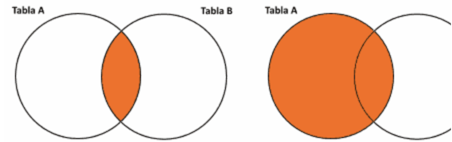
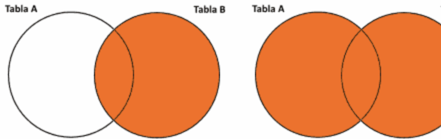

# Primeira Parte

### Como é Chamado um JOIN em um Banco de Dados ?
- Um JOIN é chamado em um banco de dados da seguinte forma:
SELECT * FROM table A INNER JOIN table B ON A.Key = B.Key

### Nomeie e explique 2 tipos de JOIN ?
- Nomeando JOIN, Temos o LEFT JOIN e o RIGHT JOIN, sendo usados dessa forma aqui:
SELECT * FROM table A A LEFT JOIN table B B ON A.Key = B.Key
SELECT * FROM table A A RIGHT JOIN table B B ON A.Key = B.Key
Left = faz com que a gente Selecione o valor da tabela a esquerda da query
right = faz com que a gente Selecione o valor da tabela a direita da query

### Para que Serve o Group By?
- GROUP BY, serve basicamente para organizar grupos que possuem um mesmo sumario de valores.

### Para que serve o HAVING ?
- HAVING, serve como um filtro de resultado baseado sobre um grupo especifico determinado.

### Dados os diagramas a seguir, indique a qual tipo de JOIN cada um corresponde:

- No primeiro exemplo da figura a esquerda, temos o uso do INNER JOIN, já na segunda figura a direita, temos o uso do LEFT JOIN.

### Escreva uma consulta genérica para cada um dos diagramas abaixo:

- No primeiro exemplo da figura a esquerda, temos o uso do RIGHT JOIN, já na segunda figura a direito, temos o uso do FULL OUTER JOIN.

